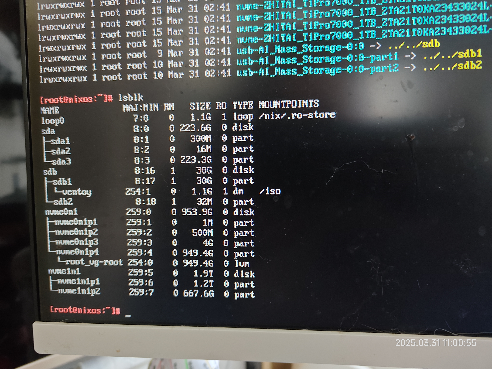

# Hydenix+Impermance

This is my personal NixOS configuration repository.

> [!WARNING]
> NixOS is not for beginners!!! Make sure you know what you are doing before
> executing anything!!!

## Features

1. Use [impermanence](https://github.com/nix-community/impermanence) for a
   minimal installation, guide by the great NixOS contributor:
   [Vimjoyer's Perfect NixOS | impermanence Setup](https://www.youtube.com/watch?v=YPKwkWtK7l0)
2. Use [hydenix](https://github.com/richen604/hydenix) as the Hyperland desktop
   environment, it's a nixos implementation of hyprdots, a hyprland dotfiles
   configuration.
3. Use
   [thundertheidiot solution about persisting /etc/shadow file](https://github.com/nix-community/impermanence/issues/120#issuecomment-2382674299)
   to allow users be able to change their password after the installation.

## Looks like

Please go to the [hydenix repository](https://github.com/richen604/hydenix) to
check out the video.

## How to use

### Preperation

1. Downloads the minimal ISO image from
   [NixOS official page](https://nixos.org/download/) because the hydenix is
   designed based on the minimal installation.
2. Use a tool like [ventoy](https://www.ventoy.net/en/index.html) to build a
   NixOS usb boot driver.

### Minimal Install

1. [Booting from the install medium](https://nixos.org/manual/nixos/stable/#sec-installation-manual)
2. `git clone https://gitee.com/jackwenyoung/nixos-impermanence.git`
3. Run `git checkout -b first-minimal --trace origin/first-minimal` to check out
   to the **first-minimal** branch.
4. Setup network

   1. Use wpa service

   ```shell
   sudo -i
   systemctl start wpa_supplicant.service
   wpa_cli
   add_network
   set_network 0 ssid "<Your Wifi Name>"
   set_network 0 psk "<Your Wifi Password>"
   enable_network 0
   <ctrl+d> to exit
   git clone https://gitee.com/jackwenyoung/nixos-impermanent.git
   ```

   2. (Optional)Setup Proxy if you have issue to connect Github, might need
      another computer with a proxy service like clash-verge.

   ```shell
   export HTTP_PROXY=http://proxy_ip:proxy_port
   export HTTPS_PROXY=http://proxy_ip:proxy_port
   export ALL_PROXY=http://proxy_ip:proxy_port
   ```

5. Get the target disk name

   1. If you have multiple disks, you should run `ls -l /dev/disk/by-id/` to get
      the unique name as the blue one in the screenshot below. The blue one for
      example: "nvme-ZHITAI_TiPro7000_1TB_ZTA21T0KA23433024L" is the device name
      you need. 
   2. If you only have one disk, the short name should work, run `lsblk` to get
      it. It should look like "/dev/sda" or "/dev/nvme" etc.
      
   3. Why? Because if you have multiple disks, the short name might be changed
      on every time you boot the machine. And it would cause system fail to
      boot, trust me, I have experienced it.

6. Run `nix-shell -p vim` to get vim or any other editor to edit the disko.nix
   file, replace the "device" to your device name.
7. Run disko to destroy,format,mount the device as the command below.

   ```shell
   nix --experimental-features "nix-command flakes" run github:nix-community/disko -- \
   -m destroy,format,mount ./nixos-impermanent/disko.nix

   or

   nix --experimental-features "nix-command flakes" run github:nix-community/disko -- \
   -m destroy,format,mount ./nixos-impermanent/disko.nix --arg device '"<your-device-name>"'
   ```

8. Run `nixos-generate-config --no-filesystems --root /mnt` to generate
   "configuration.nix" and "hardware-configuration.nix".
9. Run `cp -r ./nixos-impermanent /mnt/persist/nixos` and you need to copy the
   generated "hardware-configuration.nix" to "/mnt/persist/nixos", you can't
   just use mine obviously.
10. Modify the username, hostname, password, timezone and etc in
    `/mnt/persist/nixos`
11. Finally, Install your brand new NixOS with command:
    `nixos-install --root /mnt --flake /mnt/persist/nixos#default`

### Hydenix Install

1. Run `chown -R <your_user_name> /persist/nixos`
2. Check out to the "hydenix" branch with
   `git checkout -b --track origin/hydenix`
3. Run `sudo nixos-rebuild switch --flake /persist/nixos#<your-hostname>` to
   install the hydenix
4. Reboot and login with your initialPassword, remember using
   `passwd <your-user-name>` to change the password.
5. Happy hacking🤭!

## Thanks

- [Vimjoyer Youtube Channel](https://www.youtube.com/watch?v=YPKwkWtK7l0), I
  learned a lot from his videos about NixOS.
- [hydenix](https://github.com/richen604/hydenix), A great startup template for
  NixOS comes with beautiful and powerful presets.
- [HYDE](https://github.com/HyDE-Project/HyDE), hydenix is the nix version of
  HYDE.
- [nix-starter-configs](https://github.com/Misterio77/nix-starter-configs), I
  built my old NixOS based on this.
- [nvf](https://notashelf.github.io/nvf/index.xhtml), A good framework to build
  your own neovim mostly in nix. NixCats is also good, but I prefer to use nix
  rather than lua.
